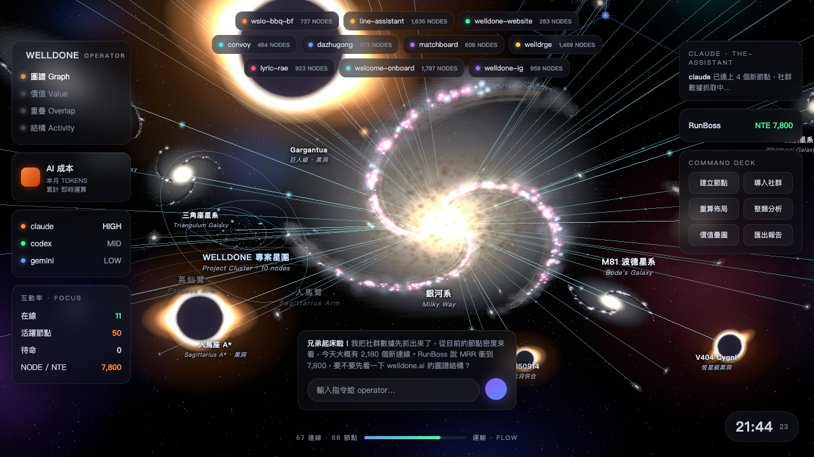
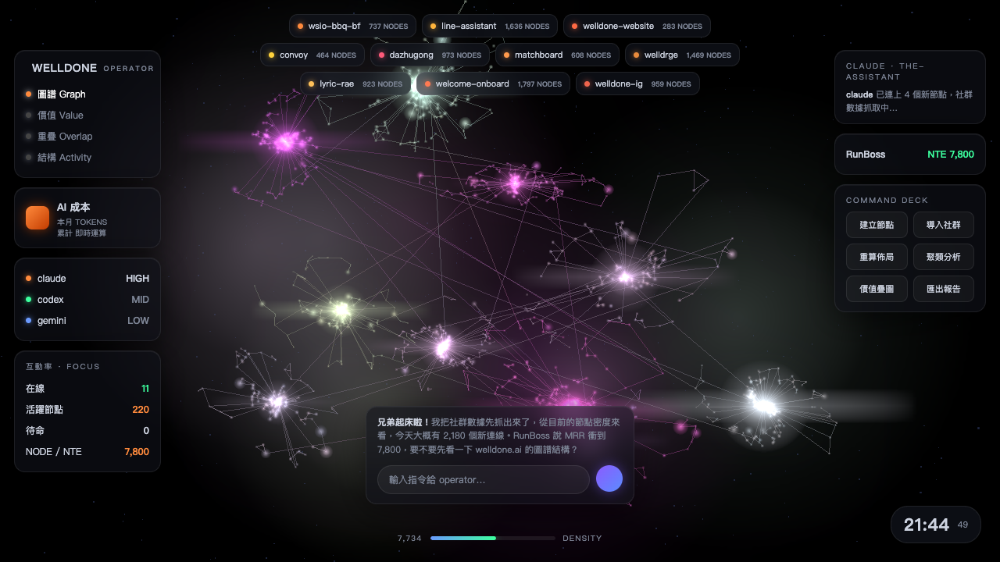
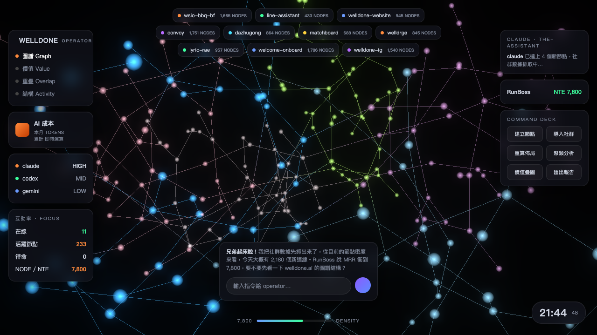

# WELLDONE OPERATOR — AI 公司儀表板

三種風格的單頁 three.js 視覺化儀表板（同一專案、三個獨立連結）。

| 風格 | 連結 | 預覽 |
|---|---|---|
| 🌌 **宇宙圖 Galaxy** — 旋渦星系 + 黑洞 + 運輸連線 | [開啟](https://gabe45665x.github.io/welldone-operator-dashboard/ai-company-dashboard-galaxy.html) |  |
| 🧠 **神經元 Neuron** — 發光叢集 + 絲線 | [開啟](https://gabe45665x.github.io/welldone-operator-dashboard/ai-company-dashboard-ultra.html) |  |
| ✨ **粒子圖 Particle** — 力導向節點網 | [開啟](https://gabe45665x.github.io/welldone-operator-dashboard/ai-company-dashboard-hifi.html) |  |

**入口頁（三個都在這）**：https://gabe45665x.github.io/welldone-operator-dashboard/

> 純前端單檔，首次開啟需連網一次載入 three.js CDN。建議用桌面 Chrome 開啟（WebGL）。
